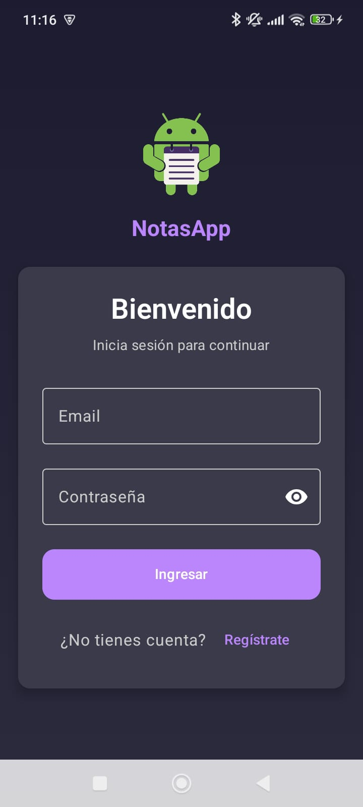
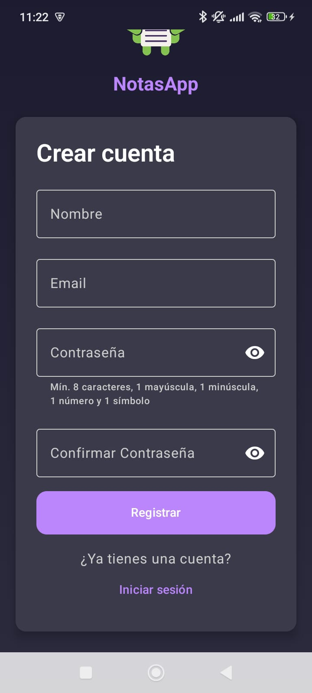
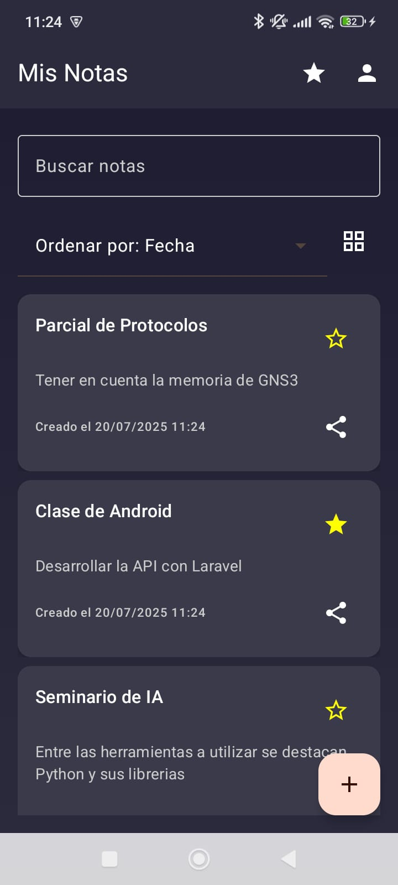
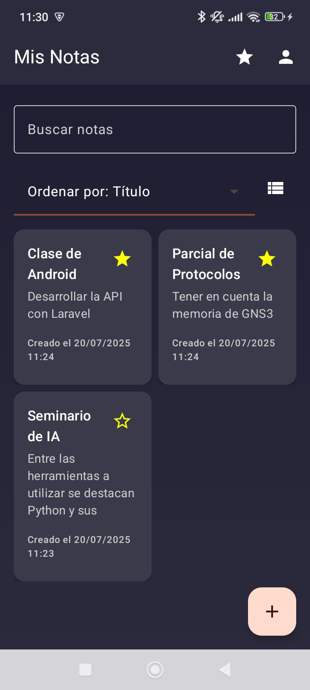
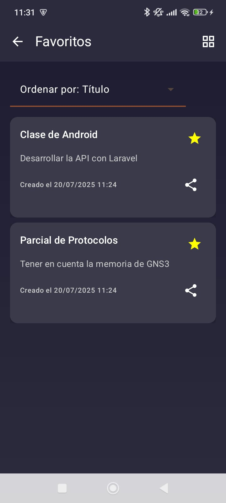
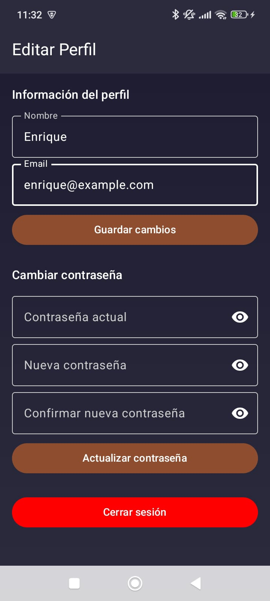

# Curso de Desarrollo de Aplicaciones Móviles
### Integrantes del equipo
- Wilfredo Cano
- Reggie Guevara
- Jeremiah Kurmaty
- Daniel Maestre
- Allan Vega

# My Notes
Este proyecto es una **aplicación de notas minimalista** donde su API fue construida por Laravel y se proyectará en Android. Su principal objetivo es permitir a los usuarios **crear notas de forma rápida y sencilla**, sin distracciones, enfocándose en la productividad.

## Funcionalidades
- Crear, editar y eliminar notas
- Marcar notas como favoritas
- Buscar y filtrar notas por contenido
- Interfaz y experiencia centradas en la simplicidad y velocidad
- Login / Registro
- Edición de perfil

### Capturas de Pantalla

